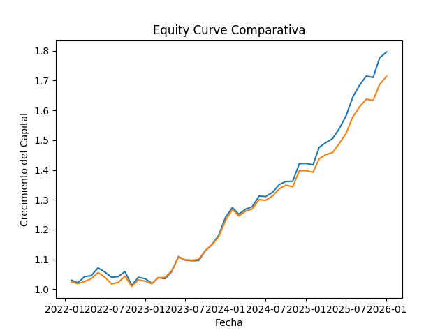
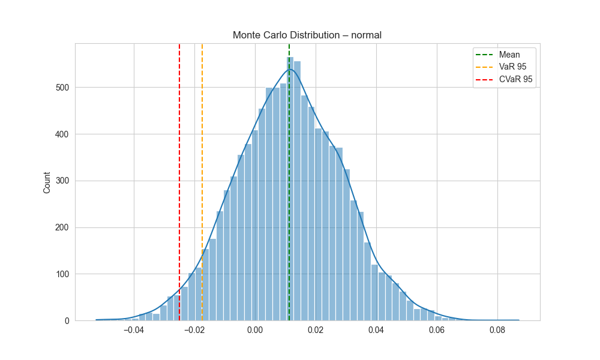
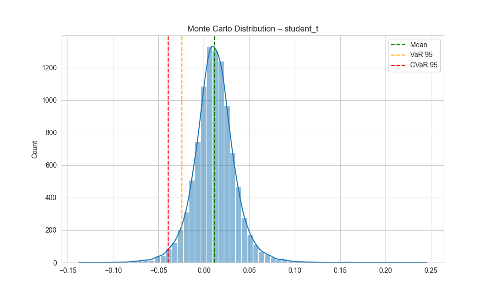
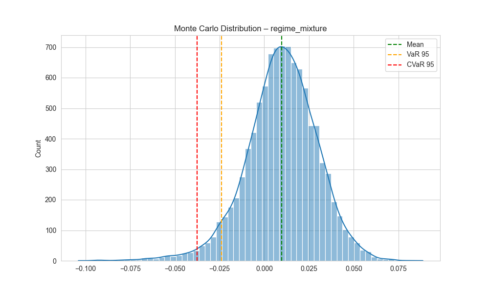
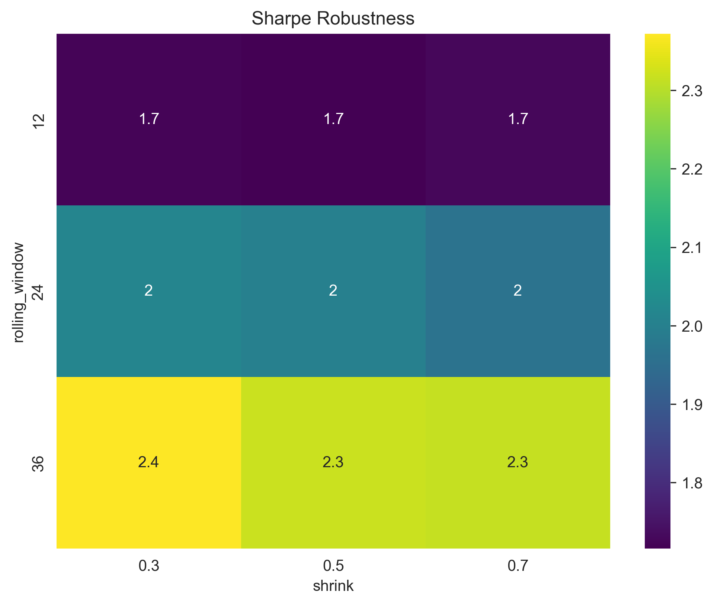

# Robust Strategic Asset Allocation Framework under Regime Uncertainty

### Overview

This project presents a **robust multi-asset portfolio allocation framework** designed to operate under:

* Estimation uncertainty
* Regime shifts
* Non-normal return distributions

Unlike traditional portfolio construction approaches, this framework integrates **robust statistics, downside risk control, and probabilistic simulation** to produce allocations with **institutional-grade risk characteristics**.

The system is built as a **modular architecture**, combining data engineering, optimization, risk analysis, and forward-looking simulation.

## Methodology

### Why not traditional Mean-Variance?

Classical **mean-variance optimization (Markowitz)** suffers from:

* Extreme sensitivity to expected returns
* Instability in covariance estimation
* Poor handling of tail risk

This framework addresses these limitations through two key design choices:

#### 1\. Ledoit-Wolf Covariance Estimation

Instead of using the sample covariance matrix, the model applies:

* **Shrinkage-based estimation (Ledoit-Wolf)**
* Improves stability in small samples
* Reduces noise in correlation structure

Result: more **robust and stable portfolio weights**

#### 2\. CVaR Optimization (Tail Risk Control)

Beyond variance, the framework explicitly models **extreme losses** using:

* Conditional Value at Risk (CVaR 95%)
* Focus on expected loss in worst-case scenarios

This allows the model to **internalize tail risk**, not just volatility.

#### 3\. Multi-Objective Optimization

The final portfolio is not a single optimum, but a **convex combination of three portfolios**:

* Minimum Variance
* Maximum Sharpe Ratio
* Minimum CVaR

This produces a **balanced allocation** between:

* Stability
* Efficiency
* Downside protection

## Architecture (Modular Design)

The framework is structured into **four core layers**:

### 1\. Data \& Universe Construction Layer

* Multi-asset dataset (Equities, Bonds, Gold, USD)
* Chilean equities filtered via **fundamental screening**
* FX normalization (CLP → USD)
* Monthly returns with rolling window (36 months)

**Goal**: Ensure data **consistency + economic validity**

### 2\. Robust Portfolio Engine

* Expected returns with shrinkage
* Covariance via Ledoit-Wolf
* Constrained optimization (asset + class limits)
* Multi-objective portfolio construction

**Output**: Robust portfolio weights (monthly rebalancing)

### 3\. Risk Engine

* VaR (Historical, Normal, Cornish-Fisher, Student-t)
* CVaR estimation
* Stress testing (systemic shocks)
* Historical replay

**Goal**: Understand downside behavior across models

### 4\. Distribution \& Simulation Engine

* Monte Carlo simulations (10,000 paths):

  1. Normal
  2. Student-t
  3. Regime-switching model
* Tail risk analysis
* Probability of loss
* Benchmark dominance comparison

**Goal:** Evaluate **forward-looking risk distributions**

### Key Results

Out-of-sample period: **Feb 2022 – Feb 2026**

Metric	        Result

Annual Return	15.41%

Volatility	 6.74%

Sharpe Ratio	 1.90

Max Drawdown	-5.51%

CVaR (95%)	-2.61%

Additional insights:

* Outperforms benchmark in 63% of periods
* Information Ratio: 0.88
* Strong drawdown control
* Stable behavior under stress scenarios

## Distribution Engine (Visual Insights)

### Monte Carlo Distributions

* Normal → underestimates tail risk

* Student-t → captures fat tails

* Regime mixture → introduces crisis asymmetry

The framework explicitly models **non-Gaussian behavior**, critical for real-world portfolios.

### Tail Risk Profile

* VaR 95% ≈ -2.4%
* CVaR 95% ≈ -3.7%
* Worst simulated scenario ≈ -10%

Indicates **controlled downside with resilience to shocks**

## Robustness \& Overfitting Control

* The model exhibits \*\*stable performance across a broad parameter space\*\*  
* There is no narrow region of extreme performance, which would indicate overfitting  
* Results remain consistent under different assumptions, supporting robustness

## Why This Matters

This project moves beyond academic optimization and aims at:

* Institutional-grade portfolio construction
* Robustness under real-world uncertainty
* Explicit modeling of tail risk and regimes

It reflects a shift from:

"Optimizing expected returns" to "Designing resilient portfolios under uncertainty"

## Future Improvements

* Bayesian return estimation
* Dynamic regime detection (HMM / ML)
* Transaction cost modeling
* Live deployment pipeline

## Author

**Cristopher Meyers Mosquera**

Multi-Asset Portfolio Research | Quantitative Finance

## Final Insight

A portfolio is not defined by its expected return,

but by how it behaves when the model is wrong.

